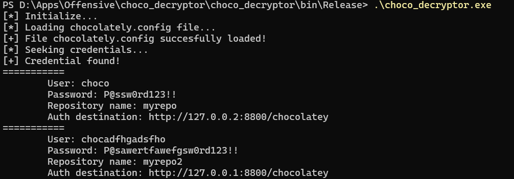

# Description
```
Simple tool for decrypt base64 blob from chocolatey.config
```
# Conditions
```
You must have read access to chocolatey.config and don't need for administrative privileges.
```
# Warning
```
Because chocolatey using DPAPI Machine key as the part of enctryption process material, 
you must run this tool from machine, where the config was made.
```


